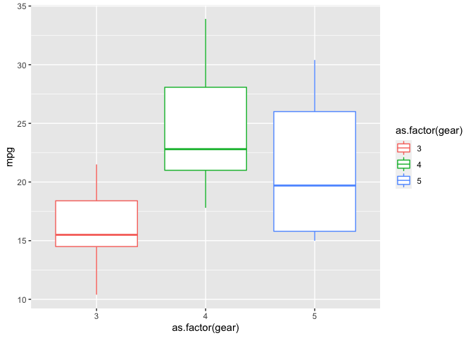
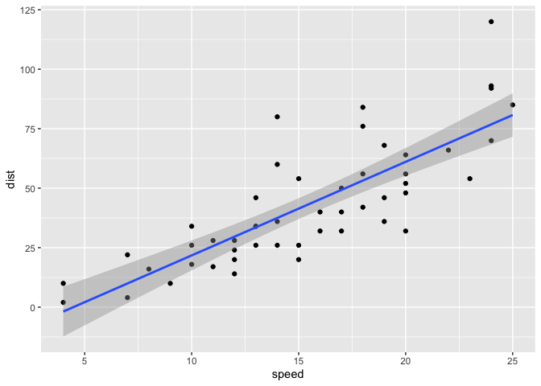
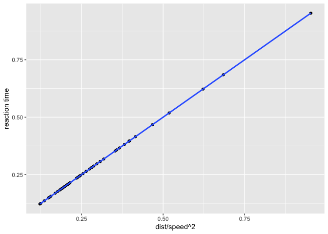

Advanced Bioinformatics 2020 Assessment
================
9511
5/2/2020

``` r
library("ggplot2")
```

Task 3.1
========

Use sum function and specify a vector of 5:55, and it will add all numbers between 5 and 55 together
----------------------------------------------------------------------------------------------------

``` r
sum (5:55)
```

    ## [1] 1530

Task 3.2
========

Assign a value of 10 to n and then create and run function sumfun
-----------------------------------------------------------------

``` r
n = 10
sumfun = sum(5:n)
sumfun
```

    ## [1] 45

Assign a value of 20 to n and then create and run function sumfun
-----------------------------------------------------------------

``` r
n = 20
sumfun = sum(5:n)
sumfun
```

    ## [1] 200

Assign a value of 100 to n and then create and run function sumfun
------------------------------------------------------------------

``` r
n = 100
sumfun = sum(5:n)
sumfun
```

    ## [1] 5040

Task 3.3
========

Set values as numeric for 12 entires of fibonacci
-------------------------------------------------

Assign values for first 2 entries of fibonacci i.e. 1 and 1
-----------------------------------------------------------

Create loop for entries up to 12
--------------------------------

``` r
fibonacci = numeric(12)
fibonacci[1] = 1
fibonacci[2] = 1
for (i in 3:12) {fibonacci[i] = fibonacci[i-1] + fibonacci[i-2]}
fibonacci
```

    ##  [1]   1   1   2   3   5   8  13  21  34  55  89 144

Task 3.4
========

``` r
ggplot(data=mtcars,aes(x=as.factor(gear),y=mpg)) + geom_boxplot(aes(col=as.factor(gear)))
```



``` r
knitr::include_graphics
```

    ## function (path, auto_pdf = getOption("knitr.graphics.auto_pdf", 
    ##     FALSE), dpi = NULL, error = TRUE) 
    ## {
    ##     path = native_encode(path)
    ##     if (auto_pdf && is_latex_output()) {
    ##         path2 = with_ext(path, "pdf")
    ##         i = file.exists(path2)
    ##         path[i] = path2[i]
    ##     }
    ##     if (error && length(p <- path[!is_web_path(path) & !file.exists(path)])) 
    ##         stop("Cannot find the file(s): ", paste0("\"", p, "\"", 
    ##             collapse = "; "))
    ##     structure(path, class = c("knit_image_paths", "knit_asis"), 
    ##         dpi = dpi)
    ## }
    ## <bytecode: 0x7fc6f51a9c38>
    ## <environment: namespace:knitr>

Task 3.5
========

Fit linear relationship using lm
--------------------------------

``` r
linearmodel <- lm(formula = dist ~ speed, data = cars)
linearmodel
```

    ## 
    ## Call:
    ## lm(formula = dist ~ speed, data = cars)
    ## 
    ## Coefficients:
    ## (Intercept)        speed  
    ##     -17.579        3.932

Intercept = -17.579, slope = 3.932
----------------------------------

Use summary function to get standard errors for intercept and slope
-------------------------------------------------------------------

``` r
summary(linearmodel)
```

    ## 
    ## Call:
    ## lm(formula = dist ~ speed, data = cars)
    ## 
    ## Residuals:
    ##     Min      1Q  Median      3Q     Max 
    ## -29.069  -9.525  -2.272   9.215  43.201 
    ## 
    ## Coefficients:
    ##             Estimate Std. Error t value Pr(>|t|)    
    ## (Intercept) -17.5791     6.7584  -2.601   0.0123 *  
    ## speed         3.9324     0.4155   9.464 1.49e-12 ***
    ## ---
    ## Signif. codes:  0 '***' 0.001 '**' 0.01 '*' 0.05 '.' 0.1 ' ' 1
    ## 
    ## Residual standard error: 15.38 on 48 degrees of freedom
    ## Multiple R-squared:  0.6511, Adjusted R-squared:  0.6438 
    ## F-statistic: 89.57 on 1 and 48 DF,  p-value: 1.49e-12

Intercept standard error = 6.7584, slope standard error = 0.4155
----------------------------------------------------------------

Use ? function to get units used for variable in the cars dataset
-----------------------------------------------------------------

``` r
?cars
```

Speed units = mph, Dist units = feet
------------------------------------

Task 3.6
========

``` r
ggplot(cars,aes(speed,dist)) + geom_point() + geom_smooth(method="lm",formula="y~x")
```



``` r
knitr::include_graphics
```

    ## function (path, auto_pdf = getOption("knitr.graphics.auto_pdf", 
    ##     FALSE), dpi = NULL, error = TRUE) 
    ## {
    ##     path = native_encode(path)
    ##     if (auto_pdf && is_latex_output()) {
    ##         path2 = with_ext(path, "pdf")
    ##         i = file.exists(path2)
    ##         path[i] = path2[i]
    ##     }
    ##     if (error && length(p <- path[!is_web_path(path) & !file.exists(path)])) 
    ##         stop("Cannot find the file(s): ", paste0("\"", p, "\"", 
    ##             collapse = "; "))
    ##     structure(path, class = c("knit_image_paths", "knit_asis"), 
    ##         dpi = dpi)
    ## }
    ## <bytecode: 0x7fc6f51a9c38>
    ## <environment: namespace:knitr>

Task 3.7
========

Convert units for dist from feet to meters
------------------------------------------

Convert units for speed from mph to m/s and square
--------------------------------------------------

Reaction time in seconds = distance/speed
-----------------------------------------

Assign values for x and y and model to get intecept and slope
-------------------------------------------------------------

``` r
cars$dist <- cars$dist * 0.3048
cars$speed <- cars$speed * 0.44704
cars$speed <- cars$speed ^2
cars$reactiontime <- cars$dist / cars$speed
x <- cars$dist / cars$speed
y <- cars$reactiontime
linearmodel1 <- lm(formula = x ~ y, data = cars)
linearmodel1
```

    ## 
    ## Call:
    ## lm(formula = x ~ y, data = cars)
    ## 
    ## Coefficients:
    ## (Intercept)            y  
    ##    3.14e-16     1.00e+00

Use intercept and slope values in formula Y = β0 + β1X, sum all values and then divide by number of values in dataset to get average reaction time in seconds
-------------------------------------------------------------------------------------------------------------------------------------------------------------

``` r
averagereactiontime = sum(3.14e-16 + (1.00e+00 * cars$reactiontime))/50
averagereactiontime
```

    ## [1] 0.282993

``` r
ggplot(cars,aes(x,y)) + geom_point() + geom_smooth(method="lm",formula="y~x") + labs(y= "reaction time", x = "dist/speed^2")
```



``` r
knitr::include_graphics
```

    ## function (path, auto_pdf = getOption("knitr.graphics.auto_pdf", 
    ##     FALSE), dpi = NULL, error = TRUE) 
    ## {
    ##     path = native_encode(path)
    ##     if (auto_pdf && is_latex_output()) {
    ##         path2 = with_ext(path, "pdf")
    ##         i = file.exists(path2)
    ##         path[i] = path2[i]
    ##     }
    ##     if (error && length(p <- path[!is_web_path(path) & !file.exists(path)])) 
    ##         stop("Cannot find the file(s): ", paste0("\"", p, "\"", 
    ##             collapse = "; "))
    ##     structure(path, class = c("knit_image_paths", "knit_asis"), 
    ##         dpi = dpi)
    ## }
    ## <bytecode: 0x7fc6f51a9c38>
    ## <environment: namespace:knitr>
